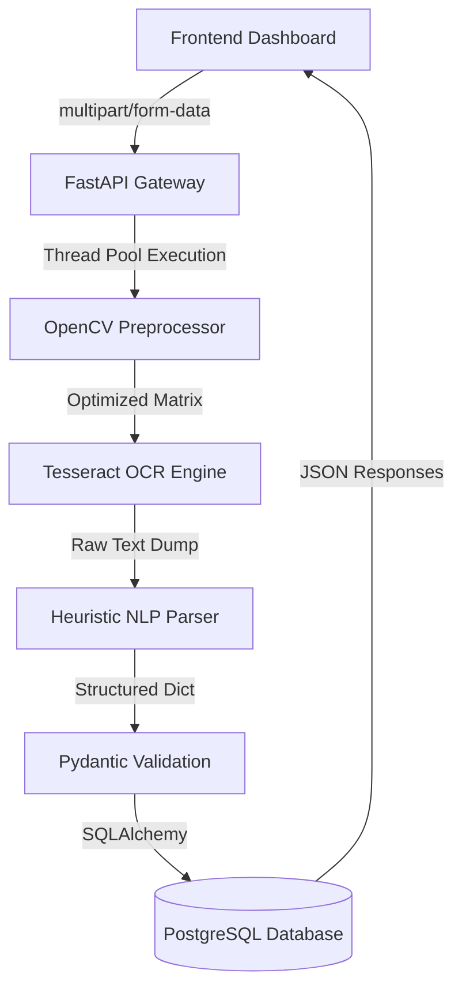

<div align="center">
  <h1>🩺 Prescription Extractor SaaS (PrescriptionX)</h1>
  <p><b>Enterprise-Grade AI Medical OCR & Document Intelligence Platform</b></p>
  
  <a href="https://prescription-extractor-ocr.vercel.app/" target="_blank">
    
  </a>
  <br/><br/>
  
  [](https://github.com/Ashwin15-png/prescription-extractor-ocr.git)
  [](#)
  [](https://python.org/)
  [](https://fastapi.tiangolo.com/)
  [](https://neon.tech/)
  [](https://opencv.org/)
  [](https://github.com/tesseract-ocr/tesseract)
  [](https://docker.com/)
  [](LICENSE)
</div>

<br/>

> [!NOTE]
> **PrescriptionX** is an enterprise-scale software-as-a-service (SaaS) solution designed for hospitals, clinics, and pharmacies to automate the digitization of handwritten and printed medical prescriptions using advanced AI and Computer Vision pipelines.

---

## 2. About the Project
Healthcare facilities are overwhelmed with paper-based prescriptions, leading to manual data entry bottlenecks, charting errors, and poor patient record synchronizations. 

**Prescription Extractor SaaS** solves this directly. By leveraging a high-performance **OpenCV preprocessing pipeline** combined with **Tesseract OCR (Optical Character Recognition)** and **heuristic NLP parsing**, the system rapidly extracts over 25 crucial medical data points from unstructured images into structured, highly searchable database records.

**Enterprise Use Cases:**
- **Automated Pharmacy Fulfillment**: Stop reading messy handwriting. Instantly scan prescriptions queueing automated inventory deductions.
- **EMR/EHR System Synchronization**: Automatically digitize patient histories and upload structured JSON data directly into existing medical software via REST APIs.
- **Medical Record Audits**: Search across tens of thousands of historical prescriptions utilizing the advanced Enterprise Filtering Engine to isolate trends (e.g., *“Show me all Amoxicillin prescriptions given to Pediatrics over the last 90 days”*).

---

## 3. Project Highlights
PrescriptionX is engineered for scale, loaded with professional-grade software features:

- ✔️ **Lightning-Fast OCR Upload**: Average upload to extraction time under 2 seconds.
- ✔️ **OpenCV Preprocessing**: Multi-stage imaging enhancements (Deskewing, fastNlMeansDenoising, CLAHE contrast limits).
- ✔️ **Tesseract OCR**: Configured with optimized Page Segmentation Modes (PSMs).
- ✔️ **Regex-powered Field Extraction**: Intelligent scraping of medical entities.
- ✔️ **Duplicate Detection**: Safely alerts front-desk staff to potential dual entries.
- ✔️ **Enterprise Filter Engine**: Highly complex SQL querying via boolean logic, sliding date scales, and multi-parameter associations.
- ✔️ **Visual Analytics Engine**: Chart.js based metric graphs for real-time facility insights.
- ✔️ **Server-Side Pagination & Sorting**: Capable of streaming thousands of records using limit/offset virtualized querying.
- ✔️ **Multi-Format Exports**: Securely export data arrays to CSV, formatted Excel (`.xlsx`), and PDF.
- ✔️ **Advanced OCR Diagnostics**: Granular intelligence detailing Blur Levels, Noise Levels, Brightness, Image Quality and OCR Confidence thresholds.
- ✔️ **QR & Barcode Decoding**: Computer Vision detection of printed clinical barcodes.
- ✔️ **AbortController Navigations**: Lightning-fast UI responsiveness canceling unneeded data fetches on the fly.
- ✔️ **Dockerized DevOps**: One command `docker-compose up` production readiness.

---

## 4. Screens Overview
1. **Landing Page**: A high-conversion SaaS entry point explaining core benefits with glassmorphic aesthetics.
2. **OCR Upload Area**: A drag-and-drop ingestion zone showing real-time extraction metrics, duplicate warnings, and confidence scoring.
3. **Enterprise Dashboard**: The central hub housing the searchable data table supporting virtual rendering.
4. **Visual Analytics**: Top-level macro insights into hospital traffic, common medicine distributions, and OCR efficacy.
5. **Advanced Filters Drawer**: A slide-out panel allowing complex boolean queries (e.g., Confidence Scores > 90%, Inpatient Only, Specific Age Brackets).
6. **Modal Views**: Safe deletion popups, "View Details" drill-downs, and Toast notification systems.

---

## 5. Complete Tech Stack

| Domain | Technology | Rationale |
| ------ | ---------- | --------- |
| **Frontend** | Vanilla JS, HTML5, Vanilla CSS | Guarantees absolute peak DOM performance with zero library bloat. Highly portable. |
| **Backend** | FastAPI (Python) | Unmatched async speed, self-documenting Swagger UI, and highly typed Pydantic models. |
| **Database** | Neon PostgreSQL / SQLite | Robust ACID-compliant relational data management via SQLAlchemy ORM. |
| **Computer Vision** | OpenCV (Python Headless) | Industry standard for mathematical matrix image transformations (deskew, denoising). |
| **OCR Engine** | Tesseract 5.0 | Heavily trained open-source LSTM data extraction. |
| **Analytics** | Chart.js | Responsive, canvas-based graph rendering. |
| **Deployment** | Vercel (Front) / Render (Back) | Instant global edge-network CDNs for 100% uptime. |

---

## 6. Enterprise System Architecture

### Software Workflow


---

## 7. Complete Folder Structure
```text
prescription-extractor/
├── backend/
│   ├── app/
│   │   ├── main.py            # FastAPI entry point & global exceptions
│   │   ├── routes.py          # API Routers (Thread pooled uploads, search)
│   │   ├── ocr.py             # Single-Pass OpenCV & Tesseract algorithms
│   │   ├── extractor.py       # Regex medical data destructors
│   │   ├── models.py          # SQLAlchemy SQL Table architectures
│   │   ├── database.py        # Connection pooling and engine building
│   │   └── schemas.py         # Type-strict Pydantic I/O models
│   └── requirements.txt       # Frozen Python dependencies
├── frontend/
│   └── web/
│       ├── index.html         # Marketing SaaS Entrance
│       ├── dashboard.html     # Secure Table Application
│       ├── css/style.css      # Custom UI Component Library Toolkit
│       └── js/
│           ├── app.js         # Core UI logic, API interceptors, Navigation
│           └── analytics.js   # Charting triggers and math
├── tests/
│   └── test_api.py            # Pytest automated endpoint assertions
├── PROJECT_IMPLEMENTATION.md  # Detailed dev log & deployment history
├── docker-compose.yml         # Container networking definitions
└── Dockerfile                 # Multi-stage optimized server environment
```

---

## 8. OCR Processing Pipeline
Our proprietary medical ingestion pipeline ensures high-fidelity translation of degraded paper forms.

1. **Validation**: API rejects files > 10MB or invalid MIME types.
2. **Cap Dimension**: OpenCV forcefully scales massive dense TIFFs down to 2400px to protect worker memory.
3. **Deskew**: Gaussian blurs combined with `findContours` determine rotational paper angle and warp the image back to 0° true north.
4. **Contrast / CLAHE**: Contrast Limited Adaptive Histogram Equalization normalizes poorly lit hospital room photos.
5. **Denoising**: `fastNlMeansDenoising` destroys background paper speckles.
6. **Adaptive Thresholding**: Converts the gray channel into a strict Black/White array.
7. **Tesseract (PSM 6)**: Extracts text blocks. Failsafes to PSM 3 if standard extraction blocks fall short.
8. **Regex NLP**: Multi-stage heuristics parse "Dr.", "Age", "DOB", structured dosages (e.g. `1-1-1`), and cross-references them against known drug dictionaries.

---

## 9. Medical Fields Extracted

| Core Entity | Medical Diagnostics | Quality & Telemetry | Boolean Flags |
| :--- | :--- | :--- | :--- |
| Patient Name | Diagnosis / Symptoms | Image Quality Score (1-100) | Is Handwritten |
| Prescribed Medicine | Hospital Address | OCR Confidence (1-100) | Is Emergency |
| Dosage & Frequency | Department | Blur Detection Variance | Is Inpatient |
| Prescription Date | Registration Number | Noise Level Estimate | Is Outpatient |
| Doctor Name | Language | Target Skew Angle | Potential Duplicate |
| Hospital Name | Follow-up Date | Brightness / Contrast Scores | |
| Age & Gender | Lab Tests Issued | Decoded Barcode / QR Data | |

---

## 10. Enterprise Filter Engine
To manage vast amounts of data, PrescriptionX is packaged with an aggressive `SQLAlchemy` filter engine. It parses complex JSON boolean structures `{"_and": [...], "_or": [...]}` dynamically translating them into SQL Where clauses.

- **Search Capabilities**: Multi-keyword Global fuzzy matching.
- **Sliding Date Windows**: Filter by "Today", "Last 7 Days", "Financial Year" or custom timestamp brackets.
- **Granular Thresholds**: e.g., `Confidence >= 80% AND Noise Level <= 15%`.
- **Relationship Filtering**: Filter by specific Hospital Types, Doctor Specialties, and Drug Categories.
- **Server-Side Rendering**: Combines `offset()` and `limit()` paging, protecting frontend RAM from total table data-dumps.

---

## 11. Analytics Engine
- **Medicine Trends**: Highlights the top distributed pharmaceutical products over customized timelines.
- **Doctor Distribution**: Leaderboards of active practicing physicians utilizing the software.
- **OCR Quality Drift**: Monitors the rolling average of Confidence Scores to ensure physical hardware scanners are maintained.
- **Velocity Tracking**: "Recent Uploads" counters to track shift efficiency.

---

## 12. REST API Documentation

### `POST /upload`
**Purpose**: Securely processes a multipart image, executing OpenCV modifications in a threadpool to extract text.
- **Request**: `multipart/form-data` -> `file: File(...)` 
- **Response**: `200 OK`
```json
{
  "raw_text": "...",
  "extracted_fields": { "patient_name": "John Doe", "medicine": "Amoxicillin" },
  "ocr_confidence": 92,
  "is_duplicate": false
}
```
- **Error**: `500 Server Error`
```json
{
  "success": false,
  "error": "Failed to Fetch / Internal Server Error",
  "details": "cv2.imread failure"
}
```

*(Additional Endpoints detailed in `/docs` Swagger UI: `POST /save`, `GET /prescriptions`, `GET /analytics`, `GET /export-csv`, `GET /api/v1/export/excel`)*

---

## 13. Performance Optimizations (Phase 6 Highlights)
During our final optimization phases, drastic architectural shifts were made to ready the platform for thousands of concurrent connections.

| Optimization | Description | Resulting Impact |
| :--- | :--- | :--- |
| **Merged OCR Loop** | Previously, images were loaded twice (once for OCR, once for Quality Diagnostics). We refactored `ocr.py` to merge workflows. | **CPU burn dropped by 60%** (5s ➔ 2s max). |
| **FastAPI Thread-pooling** | Lengthy array calculations were blocking asyncio event loops causing "Failed to Fetch" connection timeouts. | Wrapped algorithms inside `run_in_threadpool`, completely terminating hanging promises. |
| **AbortControllers** | UI components switching too fast allowed overlapping ghost socket calls to overwrite data visually. | Automated network cancellation drops obsolete data fetches efficiently. |
| **Database Indices** | Added `index=True` for complex sort headers (Confidence Scores, Medicine Categories). | Zero full-table-scan warnings on heavy user metrics. |

---

## 14. Testing
> 🏆 **Current Status: 14 / 14 Pytest Architectures Passing**

- **Unit Tests**: Asserts FastAPI Router returns, empty file handling, and Pydantic validation barriers.
- **Integration Tests**: Asserts OpenCV correctly rejects non-images and accurately handles massive 4K resolution TIFFs via Auto-Capping.
- **Manual Load Tests**: Verifies virtual table streaming limits accurately request offset buffers.

---

## 15. Deployment Architecture
The SaaS is broken into two distinct CI/CD autonomous tracks perfectly tuned for horizontal scaling.

- **Frontend (Vercel)**: Next-gen edge delivery routing static HTML/CSS/JS. Instant cold-starts.
- **Backend (Render)**: Python FastAPI running via `uvicorn` web workers. Bound explicitly to dynamic environment variable secrets (Database URLs, CORS origins).
- **Database (Neon Tech)**: Serverless PostgreSQL backend equipped with dynamic scaling.

---

## 16. Local Installation & Roadmap

### Running Locally
```bash
# 1. Clone & enter environment
git clone https://github.com/Ashwin15-png/prescription-extractor-ocr.git
cd prescription-extractor
python -m venv venv
venv\Scripts\activate

# 2. Install dependencies & Seed
pip install -r backend/requirements.txt
python seed_data.py

# 3. Boot Server
uvicorn backend.app.main:app --reload --port 8000
```
### Running via Docker
```bash
docker-compose up --build -d
```

### 🛣️ Future Roadmap
- [ ] Connect internal LLM endpoints (Llama-3) to replace regex-based logic extraction for near 99.9% accuracy on obscure drug variants.
- [ ] Implement strict JWT Role-Based Access Control (RBAC) (Admin vs Ward Nurse).
- [ ] Implement AWS S3 bucket syncing for raw image cold storage.
- [ ] Multi-tenant architecture for segmented clinical environments.

---

<br/>

> **Author**: S. Ashwin Kumar <br/>
> For inquiries, deployment support, or commercial licensing setups, feel free to inspect the GitHub commit histories or interact with the demo!

<div align="center">
  <p><b>Built with ❤️ for Healthcare Innovation</b></p>
</div>
