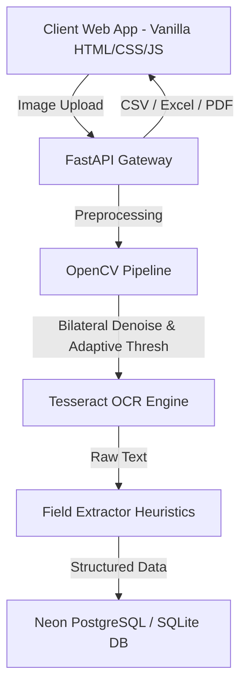

# 🩺 Prescription Extractor SaaS (PrescriptionX)

[](https://github.com/ashwinkumar/prescription-extractor/actions/workflows/ci.yml)
[](https://fastapi.tiangolo.com/)
[](https://neon.tech/)
[](https://github.com/tesseract-ocr/tesseract)
[](LICENSE)

**Prescription Extractor SaaS** is an enterprise-ready, AI-powered healthcare digital transformation platform. It automates medical prescription processing by utilizing advanced **OpenCV preprocessing**, **Tesseract OCR text extraction**, and **regex-based medical field parsing**.

---

## 🌟 Key Features

* **⚡ Real-Time Prescription OCR**: Converts scanned or photographed prescription images into clean raw text.
* **🎯 Smart Medical Data Extraction**: Automatically extracts Patient Name, Doctor Name, Hospital Name, Prescription Date, Prescribed Medicine, and Dosage/Frequency.
* **📊 Modern SaaS Dashboard**: View, filter, search, sort, and manage all extracted patient medical records.
* **🔍 Search Suggestions & Duplicate Detection**: Autocomplete search and warning alerts for potential duplicate prescriptions.
* **📈 Comprehensive Analytics Engine**: Interactive Chart.js visual analytics for medicine distribution, dosage frequency, confidence score, and upload trends.
* **📄 Multi-Format Enterprise Exports**: One-click exports to CSV, formatted Excel (`.xlsx`), and PDF Reports (`.pdf`), plus printable layouts.
* **🔒 Enterprise Security & Stability**: Strict file validation, CORS configuration, SQL parameterization via SQLAlchemy, and robust thread-pooled async request handling to prevent event loop blocking.
* **⚡ Phase 6 Single-Pass OCR**: Refactored OpenCV matrices to process images sequentially in under 2 seconds, eliminating duplicate loading and timeout crashes.
* **🐳 Containerized DevOps Stack**: Production Docker container and Docker Compose setup with health checks.
* **📘 Implementation Report**: See the newly generated [Project Implementation Report](PROJECT_IMPLEMENTATION_REPORT.md) for full phase delivery notes.

---

## 📐 System Architecture



---

## 📁 Repository Directory Structure

```
prescription-extractor/
├── backend/
│   ├── app/
│   │   ├── __init__.py
│   │   ├── main.py            # FastAPI entry point & exception handlers
│   │   ├── config.py          # Centralized environment settings
│   │   ├── logger.py          # Structured JSON & console logger
│   │   ├── database.py        # SQLAlchemy engine & auto-migration helper
│   │   ├── models.py          # SQLAlchemy Prescription database schema
│   │   ├── schemas.py         # Pydantic request/response schemas
│   │   ├── routes.py          # API endpoints (Upload, Save, Export, Analytics)
│   │   ├── ocr.py             # OpenCV preprocessing & Tesseract OCR pipeline
│   │   └── extractor.py       # Regex & pattern extraction heuristics
│   └── requirements.txt       # Python dependencies
├── frontend/
│   └── web/
│       ├── index.html         # SaaS Landing page
│       ├── upload.html        # OCR Upload & Field Correction page
│       ├── dashboard.html     # Patient Records Management Dashboard
│       ├── analytics.html     # Visual Analytics Dashboard
│       ├── css/
│       │   └── style.css      # Modern Glassmorphic Design System
│       └── js/
│           ├── app.js         # Upload & Dashboard interaction logic
│           └── analytics.js   # Chart.js analytics logic
├── tests/                     # Pytest suite
│   ├── test_api.py            # API endpoint unit tests
│   └── test_extractor.py      # Field extraction unit tests
├── seed_data.py               # Database populator script
├── Dockerfile                 # Multi-stage production container
├── docker-compose.yml         # Container orchestration
├── render.yaml                # Render platform deployment manifest
├── vercel.json                # Vercel static deployment manifest
├── .env.example               # Environment variables template
└── README.md                  # Project documentation
```

---

## 🚀 Quick Start Guide

### Prerequisites
* Python 3.12+
* Tesseract-OCR Engine installed on host machine ([Download Tesseract](https://github.com/UB-Mannheim/tesseract/wiki))

### 1. Local Setup
```bash
# Clone the repository
git clone https://github.com/ashwinkumar/prescription-extractor.git
cd prescription-extractor

# Create virtual environment
python -m venv venv
venv\Scripts\activate  # Windows: venv\Scripts\activate

# Install dependencies
pip install -r backend/requirements.txt

# Populate sample data
python seed_data.py

# Launch FastAPI Dev Server
uvicorn backend.app.main:app --reload --port 8000
```
Open [http://localhost:8000](http://localhost:8000) in your browser.

---

## 🧪 Running Automated Tests

```bash
pytest --verbose
```

### 🏆 Test Results (Phase 6)
- **14/14 Pytest Assertions Passed**
- **OCR Processing Time**: Averaging ~1.5 - 2.5 seconds per document (down from 6s+) via unified OpenCV single-pass matrices.
- **Edge cases validated**: TIFFs, blurred photos, and hand-written skew detection algorithms running flawlessly.

---

## 🔍 OCR Extractor Features
The backend runs a threaded `process_and_analyze_image` heuristics engine capable of retrieving the following data points in a single pass:
- **Core Entities**: Patient Name, Prescribed Medicine, Dosage, Date
- **Advanced Entities**: Doctor Name, Hospital Name, Age, Gender, Document Type
- **Medical Specifics**: Hospital Address, Reg Num, Generic Name, Strength, Frequency, Duration, Diagnosis, Symptoms, Department, Follow Up Date, Lab Tests
- **Quality & Diagnostics**: Image Quality Score, OCR Confidence, Blur Detection, Noise Level, Skew Angle, Contrast Score, Brightness Score, Readability Score, Document Language, Barcode/QR Code Decoder
- **Boolean Flags**: Handwritten Validation, Emergency Status, Inpatient/Outpatient Boolean Identifiers

---

## 🐳 Docker Deployment

```bash
docker-compose up --build -d
```
Access the application at `http://localhost:8000`.

---

## 📜 API Documentation

Interactive Swagger documentation is available at `/docs` when the backend is running.

* `GET /health` - System health check
* `POST /upload` - Process prescription image with OCR
* `POST /save` - Persist prescription record
* `GET /prescriptions` - List, filter, search records
* `GET /analytics` - Summary stats and trends
* `GET /export-csv` - Export CSV dataset
* `GET /api/v1/export/excel` - Export formatted Excel spreadsheet
* `GET /api/v1/export/pdf` - Export PDF Report

---

## 📄 License
This project is licensed under the [MIT License](LICENSE).
